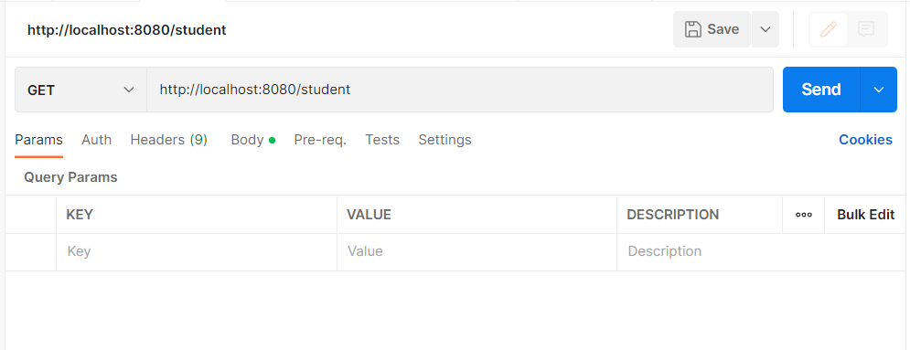
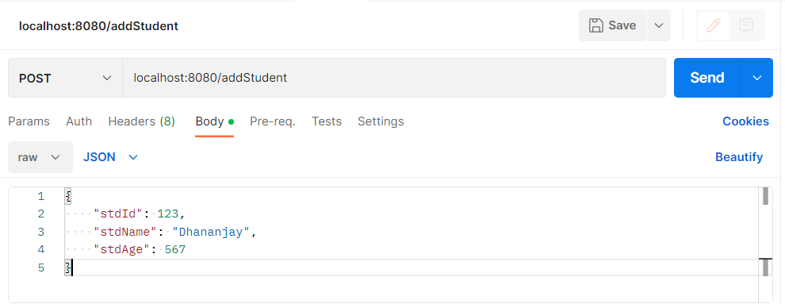
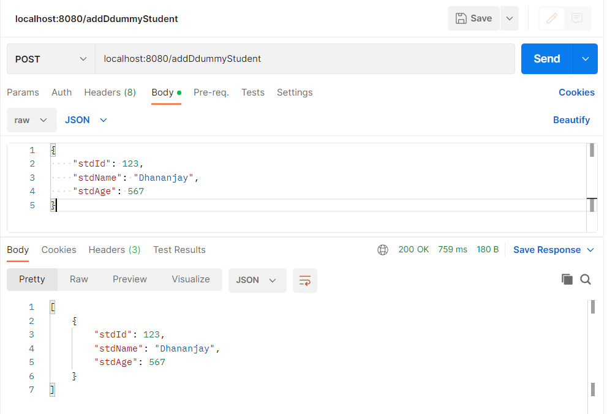

"# SpringBootRestwithH2" 

This application have 3 endpoints as below:
GET --> /student
POST --> /addStudent
POST --> /addDummyStudent

Application start on port number 8080.
It works on JAVA 11

Endpoints will work as below.
Note: You can import curl commands in POSTMAN to check application running.

To fetch Student use GET endpoint like below example :
curl --location --request GET 'localhost:8080/addStudent'

To add Student use POST endpoint like below example :
curl --location --request POST 'localhost:8080/addStudent' \
--header 'Content-Type: application/json' \
--data-raw '{
"stdId": 123,
"stdName": "Dhananjay",
"stdAge": 567
}'

To test POST endpoints use POST /addDummyStudent endpoint :
curl --location --request POST 'localhost:8080/addDdummyStudent' \
--header 'Content-Type: application/json' \
--data-raw '{
"stdId": 123,
"stdName": "Dhananjay",
"stdAge": 567
}'

